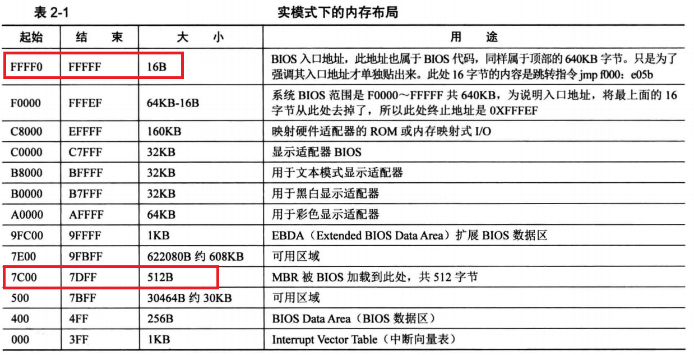

# 一、内存地址表



* 在bios启动时会将硬盘上第一个扇区的内容读入内存地址为0x7C00处，然后跳转到0x7C00处执行
* 而0x7C00的内容固定为512B，最后两个字节内容为0xAA、0x55。如果最后两个字节内容不为0xAA、0x55，则bios会认为这个扇区不是操作系统引导扇区，从而继续寻找下一个扇区。

# 二、实模式下的中断

| 中断地址 | 描述                                                                                                                                      |
|------|-----------------------------------------------------------------------------------------------------------------------------------------|
| 0x00 | 除零错，或商不合法时触发                                                                                                                            |
| 0x01 | 单步执行，TF标记为打开状态时，每条指令执行后触发                                                                                                               |
| 0x02 | 非屏蔽中断，用于系统调用                                                                                                                            |
| 0x03 | 第一个未定义的中断向量，约定俗成仅用于调试程序                                                                                                                 |
| 0x04 | 算数溢出，通常由INTO指令在置溢出位时触发                                                                                                                  |
| 0x05 | 在按下Shift+Print Screen或BOUND指令检测到范围异常时触发                                                                                                 |
| 0x06 | 非法指令                                                                                                                                    |
| 0x07 | 没有数学协处理器时尝试执行浮点指令触发                                                                                                                     |
| 0x08 | IRQ0: 可编程中断控制器，每55毫秒触发一次，即每秒18.2次                                                                                                       |
| 0x09 | IRQ1: 每次键盘按下、按住、释放                                                                                                                      |
| 0x0A | IRQ2:                                                                                                                                   |
| 0x0B | IRQ3: COM2/COM4                                                                                                                         |
| 0x0C | IRQ4: COM1/COM3                                                                                                                         |
| 0x0D | IRQ5: 硬盘控制器(PC/XT 下)或LPT2                                                                                                               |
| 0x0E | IRQ6: 需要时由软盘控制器调用                                                                                                                       |
| 0x0F | IRQ7: LPT1                                                                                                                              |
| 0x10 | 显示服务，由BIOS或操作系统设定以供软件调用                                                                                                                 |
| 0x11 | 返回设备列表                                                                                                                                  |
| 0x12 | 获取常规内存容量                                                                                                                                |
| 0x13 | 低级磁盘服务                                                                                                                                  |
| 0x14 | 串口通信例程                                                                                                                                  |
| 0x15 | 其它(系统支持例程)                                                                                                                              |
| 0x16 | 键盘通信例程                                                                                                                                  |
| 0x17 | 打印服务                                                                                                                                    |
| 0x18 | 执行磁带上的BASIC程序：”真正的“IBM兼容机zai里内置BASIC程序，当引导失败时由BIOS调用此例程解释执行。(例：打印"Boot disk error.Replace disk and press any key to continue..."这类提示信息) |
| 0x19 | 加电自检之后加载操作系统                                                                                                                            |
| 0x1A | 实时钟服务                                                                                                                                   |
| 0x1B | Ctrl+Break，由IRQ9自动调用                                                                                                                    |
| 0x1C | 预留，由IRQ8自动调用                                                                                                                            |
| 0x1D | 不可调用：指向视频参数表(包含视频模式的数据)的指针                                                                                                              |
| 0x1E | 不可调用：指向软盘参数表(包含关于软驱的大量信息)的指针                                                                                                            |
| 0x1F | 不可调用：指向视频图形字符表(包含从0x80到0xFF的ASCII字符的数据)的信息                                                                                              |
| 0x41 | 地址指针：硬盘参数表(第一硬盘)                                                                                                                        |
| 0x46 | 地址指针：硬盘参数表(第二硬盘)                                                                                                                        |
| 0x4A | 实时钟在闹铃时调用                                                                                                                               |
| 0x70 | IRQ8：由实时钟调用                                                                                                                             |
| 0x74 | IRQ12：由鼠标调用                                                                                                                             |
| 0x75 | IRQ13：由数学协处理器调用                                                                                                                         |
| 0x76 | IRQ14：由第一个IDE控制器所调用                                                                                                                     |
| 0x77 | IRQ15：由第二个IDE控制器所调用                                                                                                                     |

### INT 0x10 中断下 AH 寄存器内容功能表

| AH 寄存器内容 | 功能          | 调用参数                                                                                                                                                                                                                    | 返回参数/注释                                   |
|----------|-------------|-------------------------------------------------------------------------------------------------------------------------------------------------------------------------------------------------------------------------|-------------------------------------------|
| 0x00     | 设定显示模式      |                                                                                                                                                                                                                         |                                           |
| 0x01     | 设定游标形态      | (CH)=光标开始行<br>(CL)=光标结束行                                                                                                                                                                                                |                                           |
| 0x02     | 设置光标位置      | BH=页号<br>DH=行<br>DL=列                                                                                                                                                                                                   |                                           |
| 0x03     | 获取光标位置与形态   | DH=页号                                                                                                                                                                                                                   | CH=光标开始行<br>CL=光标结束行<br>DH=行<br>DL=列      |
| 0x04     | 获取光标位置      | AL=显示页号                                                                                                                                                                                                                 |                                           |
| 0x05     | 设置显示页       |                                                                                                                                                                                                                         |                                           |
| 0x06     | 清除或滚动栏画面(上) | AL = 上卷行数<br>AL =0全屏幕为空白<br>BH = 卷入行属性<br>CH = 左上角行号<br>CL = 左上角列号<br>DH = 右下角行号<br>DL = 右下角列号                                                                                                                          |                                           |
| 0x07     | 清除或滚动栏画面(下) | AL = 下卷行数<br>AL = 0全屏幕为空白<br>BH = 卷入行属性<br>CH = 左上角行号<br>CL = 左上角列号<br>DH = 右下角行号<br>DL = 右下角列号                                                                                                                         |                                           |
| 0x08     | 读取游标处字符与属性  | BH = 显示页<br>AH = 属性<br>AL = 字符                                                                                                                                                                                          |                                           |
| 0x09     | 更改游标处字符与属性  | BH = 显示页<br>AL = 字符<br>BL = 属性<br>CX = 字符重复次数                                                                                                                                                                           |                                           |
| 0x0A     | 更改光标处字符     | BH = 显示页<br>AL = 字符<br>CX = 字符重复次数                                                                                                                                                                                      |                                           |
| 0x0B     | 设定边界颜色      |                                                                                                                                                                                                                         |                                           |
| 0x0E     | 在TTY模式下写字符  | AL = 字符<br>BL = 前景色                                                                                                                                                                                                     | 光标跟随字符移动                                  |
| 0x0F     | 获取当前显示模式    |
| 0x13     | 写字符串        | ES:BP = 串地址<br>CX = 串长度<br>DH， DL = 起始行列<br>BH = 页号<br>AL = 0<br>BL = 属性<br>串：Char，char，……，char<br>AL = 1<br>BL = 属性<br>串：Char，char，……，char<br>AL = 2<br>串：Char，attr，……，char，attr<br>AL = 3<br>串：Char，attr，……，char，attr | 光标返回起始位置<br>光标跟随移动<br>光标返回起始位置<br>光标跟随串移动 |

### INT 0x13 中断下 AH 寄存器内容功能表

| AH 寄存器内容 | 功能         | 调用参数                                                       | 返回参数/注解                              |
|----------|------------|------------------------------------------------------------|--------------------------------------|
| 0x00     | 复位磁盘驱动器    |                                                            |                                      |
| 0x01     | 检查磁盘驱动器状态  |                                                            | AL=状态字节                              |
| 0x02     | 读扇区        | AL=扇区数<br>CH,CL=磁盘号,扇区号<br>DH,DL=磁头号,驱动器号<br>ES:BX=数据缓冲区地址 | 读成功:AH=0<br>AL=读取的扇区数<br>读失败:AH=出错代码 |
| 0x03     | 写扇区        | 同上                                                         | 写成功:AH=0，AL=写入的扇区数<br>写失败:AH=出错代码     |
| 0x04     | 验证扇区       | 同上(ES:BX不设置)                                               | 写成功:AH=0，AL=校验的扇区数<br>写失败:AH=出错代码     |
| 0x05     | 格式化磁盘      | ES：BX=磁道地址                                                 | 成功:AH=0<br>失败:AH=出错代码                |
| 0x08     | 获取驱动器参数    |                                                            |                                      |
| 0x09     | 初始化硬盘驱动器参数 |                                                            |                                      |
| 0x0C     | 寻道         |                                                            |                                      |
| 0x0D     | 复位硬盘控制器    |                                                            |                                      |
| 0x15     | 获取驱动器类型    |                                                            |                                      |
| 0x16     | 获取软盘中盘片的状态 |                                                            |                                      |

### INT 0x14 中断下 AH 寄存器内容功能表

| AH 寄存器内容 | 功能    |
|----------|-------|
| 0x00     | 初始化串口 |
| 0x01     | 写出字符  |
| 0x02     | 读入字符  |
| 0x03     | 状态    |

### INT 0x15 中断下 AH 寄存器内容功能表

| AH 寄存器内容  | 功能                                  |
|-----------|-------------------------------------|
| 0x4F      | 键盘拦截                                |
| 0x83      | 事件等待                                |
| 0x84      | 读游戏杆                                |
| 0x85      | SysRq键                              |
| 0x86      | 等待                                  |
| 0x87      | 块移动                                 |
| 0x88      | 获取扩展内存容量                            |
| 0xC0      | 获取系统参数                              |
| 0xC1      | 获取扩展BIOS数据区块                        |
| 0xC2      | 指针设备功能                              |
| AX=0xE801 | 获取扩展内存容量，可获取到64MB以上的内存容量            |
| AX=0xE820 | 查询系统地址映射，该功能取代了AX=0xE801和AH=0x88的功能 |

### INT 0x16 中断下 AH 寄存器内容功能表

| AH 寄存器内容 | 功能                  |
|----------|---------------------|
| 0x00     | 读字符                 |
| 0x01     | 读输入状态               |
| 0x02     | 读Shift键(修改键)状态      |
| 0x10     | 读字符(增强版)            |
| 0x11     | 读输入状态(增强版)          |
| 0x12     | 读Shift键(修改键)状态(增强版) |

### INT 0x17 中断下 AH 寄存器内容功能表

| AH 寄存器内容 | 功能      |
|----------|---------|
| 0x00     | 打印字符    |
| 0x01     | 初始化打印机  |
| 0x02     | 检查打印机状态 |

### INT 0x1A 中断下 AH 寄存器内容功能表

| AH 寄存器内容 | 功能      |
|----------|---------|
| 0x00     | 读取实时钟   |
| 0x01     | 设置实时钟   |
| 0x02     | 读取实时钟时间 |
| 0x03     | 设置实时钟时间 |
| 0x04     | 读取实时钟日期 |
| 0x05     | 设置实时钟日期 |
| 0x06     | 设置实时钟闹铃 |
| 0x07     | 重置实时钟闹铃 |

# 三、实模式下的I/O端口
在这个模式下需要使用out和in与外部设备进行通信；同样可以使用INT中断与外部设备进行通信，使用INT中断的原理是bios将外部设备与内存进行统一编制。
## 1.硬盘控制器
在实模式下有IDE和SATA两种硬盘类型
而实模式中有两个控制器(主控制器和从控制器)，每个控制器又有两个盘(主盘和从盘)
### 硬盘控制器端口
<table>
    <tr>
      <th colspan="2">I/O端口号</th>
      <th colspan="2">端口用途</th>
      <th rowspan="2">端口位数</th>
    </tr>
    <tr>
        <th>主控制器</th>
        <th>从控制器</th>
        <th>读取操作</th>
        <th>写入操作</th>
    </tr>
    <tr>
        <td>0x1f0</td>
        <td>0x170</td>
        <td>Data</td>
        <td>Data</td>
        <td>16</td>
    </tr>
    <tr>
        <td>0x1f1</td>
        <td>0x171</td>
        <td>Error</td>
        <td>Features</td>
        <td rowspan="7">8</td>
    </tr>
    <tr>
        <td>0x1f2</td>
        <td>0x172</td>
        <td>操作的扇区数</td>
        <td>操作的扇区数</td>
    </tr>
    <tr>
        <td>0x1f3</td>
        <td>0x173</td>
        <td>LBA低八位</td>
        <td>LBA低八位</td>
    </tr>
    <tr>
        <td>0x1f4</td>
        <td>0x174</td>
        <td>LBA中八位</td>
        <td>LBA中八位</td>
    </tr>
    <tr>
        <td>0x1f5</td>
        <td>0x175</td>
        <td>LBA高八位</td>
        <td>LBA高八位</td>
    </tr>
    <tr>
        <td>0x1f6</td>
        <td>0x176</td>
        <td>Device</td>
        <td>Device</td>
    </tr>
    <tr>
        <td>0x1f7</td>
        <td>0x177</td>
        <td>Status</td>
        <td>Command</td>
    </tr>
</table>

#### 0x1f6表
| bit     | 内容                  | 说明                     |
| ------- | ------------------- | ---------------------- |
| 7       | 1                   | 固定为1                   |
| 6       | MOD                 | 选择寻址模式，0为CHS模式，1为LBA模式 |
| 5       | 1                   | 固定为1                   |
| 4       | DEV                 | 选择硬盘驱动器，0为主硬盘，1为从硬盘    |
| 3,2,1,0 | [27],[26],[25],[24] | LBA地址的第24～27位          |

#### 0x1f7表
|bit|内容|说明|
|---|---|---|
|7|BSY|此位为1表示硬盘正忙，勿扰|
|6|DRDY|此位为1表示设备就绪，等待指令|
|5||已废弃|
|4||已废弃|
|3|DRQ|此位为1表示可以从数据端口读写硬盘数据了|
|2||已废弃|
|1||已废弃|
|0|ERR|此位为1表示有错误发生，错误信息见Error寄存器|

### 硬盘操作步骤
#### 读硬盘
 * 读取Status端口，如果该端口第7位为0、第6位为1，进入下一步，否则循环当前步骤
 * 向`操作的扇区数`端口写入要读入的扇区数，范围为0～255，如果为0表示读取256个扇区
 * 向LBA低、中、高三个端口写入LBA起始扇区的低24位
 * 向Device端口写入LBA起始扇区的24～27位，并置第4位为0,第6位为1(表示主硬盘，LBA模式)
 * 向Command端口写入0x20，即0b0010_0000(表示读扇区)
 * 读取Status端口，如果该端口第7位为0、第3位为1，进入下一步，否则循环当前步骤
 * 从Data端口读取数据。如果读1个扇区，则循环读取该端口256次
 
#### 写硬盘
 * 读取Status端口，如果该端口第7位为0、第6位为1，进入下一步，否则循环当前步骤
 * 向`操作的扇区数`端口写入要写入的扇区数，范围为0～255，如果为0表示读取256个扇区
 * 向LBA低、中、高三个端口写入LBA起始扇区的低24位
 * 向Device端口写入LBA起始扇区的24～27位，并置第4位为0,第6位为1(表示主硬盘，LBA模式)
 * 向Command端口写入0x30，即0b0011_0000(表示读扇区)
 * 读取Status端口，如果该端口第7位为0、第3位为1，进入下一步，否则循环当前步骤
 * 向Data端口写入数据。如果写入1个扇区，则循环写入该端口256次
 
>注意，这个地方读写硬盘的方式为LBA模式，它是将所有硬盘的扇区进行统一编址，从而舍去了CHS模式下的磁头号、柱面号和扇区号；而在INT 0x13模式下读取硬盘的方式是CHS模式

# 四、现代LBA硬盘读取方式

### **概述**
磁盘地址包（DAP，Disk Address Packet）是用于 BIOS 进行 **LBA（逻辑块寻址）** 读取或写入操作时的数据结构。通过 DAP，BIOS 可以访问硬盘的任意逻辑扇区，而不受传统的 **CHS（柱面-磁头-扇区）** 限制。DAP 被用于 **INT 0x13 AH=0x42** 的扩展磁盘读取功能，适用于大容量硬盘，解决了 CHS 的 1024 柱面限制。
### **DAP 结构**
DAP 是一个 16 字节的结构体，包含了用于描述磁盘 I/O 请求的详细信息。其具体字段如下：
#### **DAP 结构格式**
```c
struct DAP {
    db 0x10          ; 数据包大小 (16 字节)
    db 0x00          ; 保留 (必须为 0)
    dw 扇区数        ; 要读取的扇区数量 (小端字节序)
    dw 目标内存段    ; 目标内存段 (小端字节序)
    dw 目标内存偏移  ; 目标内存偏移 (小端字节序)
    dq LBA地址       ; LBA 扇区号 (64 位)
}
```
### **字段详细说明**
1. **数据包大小（0x10）**：
    - 固定为 `0x10`，表示此数据包的大小为 16 字节。BIOS 根据此值判断数据包长度。
2. **保留字段（0x00）**：
    - 该字段必须为 `0`，用于对齐并保留。
3. **扇区数**：
    - `dw 扇区数`（2 字节）表示要读取或写入的扇区数量。通常情况下，一个操作请求的扇区数为 1，但可以根据需要指定多个扇区。
4. **目标内存段和偏移**：
    - `dw 目标内存段`：表示数据应存放的内存段地址。
    - `dw 目标内存偏移`：表示数据应存放的内存偏移地址。通常内存地址为 `0x7C00`，表示引导区。
5. **LBA 地址（64 位）**：
    - `dq LBA地址`（8 字节）表示逻辑块寻址的 LBA 地址。LBA 地址是磁盘的逻辑扇区编号，允许访问更大的磁盘，超过 CHS 的 1024 柱面限制。

### **LBA 和 CHS 的区别**
- **LBA（逻辑块寻址）**：基于逻辑扇区编号寻址，不依赖于柱面、磁头、扇区的物理结构。
- **CHS（柱面-磁头-扇区）**：基于物理硬盘的柱面、磁头、扇区寻址，受到最大 1024 柱面的限制。
LBA 解决了 CHS 模式的局限性，支持大于 8.4 GB 的硬盘，使用逻辑块编号直接访问硬盘。
### **使用 DAP 读取磁盘（LBA）**
使用 DAP 的常见场景是通过 **INT 0x13 AH=0x42** 实现 **LBA 读取**。以下是如何在汇编程序中使用 DAP 的示例：
#### **汇编代码示例：读取第一个 LBA 扇区**
假设我们要读取第 **0** 个 LBA 扇区（通常是 MBR 扇区）到内存地址 `0x7C00`，DAS 结构定义如下：
```assembly
dap:
    db 0x10          ; 数据包大小 (16 字节)
    db 0x00          ; 保留 (0)
    dw 1             ; 读取 1 个扇区
    dw 0x0000        ; 目标内存段 (0x0000)
    dw 0x7C00        ; 目标内存偏移 (0x7C00)
    dq 0x0000000000  ; LBA 地址 (0，即第 0 个扇区，MBR)
```
然后，调用 **INT 0x13 AH=0x42** 扩展功能，开始 LBA 读取：
```assembly
mov ah, 0x42          ; 扩展 LBA 读取
mov dl, 0x80          ; 第一个硬盘
mov si, dap           ; DS:SI 指向 DAP
int 0x13              ; 调用 BIOS 磁盘中断
```
### **错误处理**
调用 `INT 0x13` 后，需要检查 **进位标志（CF）** 来确认是否成功：
- 如果 **CF = 1**，表示读取失败，跳转到错误处理。
- 如果 **CF = 0**，表示成功，继续执行。
### **总结**
- **磁盘地址包（DAP）** 是在 **LBA（逻辑块寻址）** 模式下与 BIOS 交互时使用的结构，允许直接通过逻辑扇区号访问硬盘。
- **LBA** 模式解决了 CHS 的 1024 柱面限制，支持大容量硬盘。
- DAP 结构包含 **扇区数**、**目标内存地址**、**LBA 地址** 等关键信息，提供了与硬盘交互的详细描述。
DAP 是操作系统引导程序、MBR 引导、磁盘管理工具等低级磁盘操作中不可或缺的一部分，帮助实现高效的磁盘访问和管理。

# 五、80\*25文本模式下的颜色表

<table>
<tr>
<th rowspan="2">R</th>
<th rowspan="2">G</th>
<th rowspan="2">B</th>
<th>背景色</th>
<th colspan="2">前景色</th>
</tr>
<tr>
<th>K=0时不闪烁，K=1时闪烁</th>
<th>l=0</th>
<th>l=1</th>
</tr>
<tr>
<td>0</td>
<td>0</td>
<td>0</td>
<td>黑</td>
<td>黑</td>
<td>灰</td>
</tr>
<tr>
<td>0</td>
<td>0</td>
<td>1</td>
<td>蓝</td>
<td>蓝</td>
<td>浅蓝</td>
</tr>
<tr>
<td>0</td>
<td>1</td>
<td>0</td>
<td>绿</td>
<td>绿</td>
<td>浅绿</td>
</tr>
<tr>
<td>0</td>
<td>1</td>
<td>1</td>
<td>青</td>
<td>青</td>
<td>浅青</td>
</tr>
<tr>
<td>1</td>
<td>0</td>
<td>0</td>
<td>红</td>
<td>红</td>
<td>浅红</td>
</tr>
<tr>
<td>1</td>
<td>0</td>
<td>1</td>
<td>品(洋)红</td>
<td>品(洋)红</td>
<td>浅品(洋)红</td>
</tr>
<tr>
<td>1</td>
<td>1</td>
<td>0</td>
<td>棕</td>
<td>棕</td>
<td>黄</td>
</tr>
<tr>
<td>1</td>
<td>1</td>
<td>1</td>
<td>白</td>
<td>白</td>
<td>亮白</td>
</tr>
</table>

# 补充、实模式下的显示区域
在实模式下的显示区域大小为每页80\*25,一共有8页
