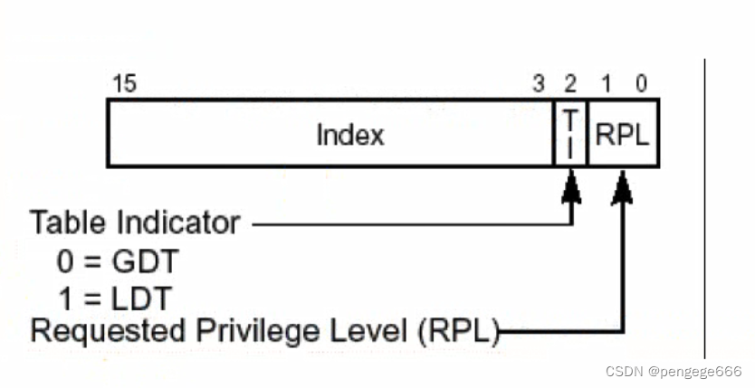

# 一、段描述符

内存段是一片内存区域，访问内存就要提供**段基址**(段基址属性)以及**段界限属性**(约束段大小)。

## 1. 段描述符说明

**段描述符**是位于 **GDT(Global Descriptor Table)或LDT(Local Descriptor Table)** 中8字节大小的表项，用来描述内存段的属性。给处理器提供一个段的位置、界限、访问特权等信息。具体格式如下:
<br>
保护模式下地址总线宽度是32位，段基址需要用32为地址来表示。

## 2. 段表述符属性介绍

* 低32位: 第0~15为用来存储段的段界限前0~15位。 **段界限表示段边界的扩展最值** ，即最大扩展到多少或最小扩展到多少。

$$
实际段界限 = (描述符中段界限 + 1) \times 粒度 - 1
$$

> 其中，G表示段界限粒度，0表示粒度为1byte，1表示粒度为4KB。

* 低32位: 第16~31位用来存储段基址0~15位。
* 高32位: 第0~7位是段基址的16~23位。
* 高32位: 第8~11位是type字段，共4位，用来指定本描述符的类型。type类型和S字段配合使用。
* 高32位: 第12位是S字段。S为0时表示系统段，S为1是表示数据段。
* 高32位: 第13~14位是DPL(Descriptor Privilege Level)字段，即描述符特权级。2位能表示4种特权级，数字越小，特权级越大。
* 高32位: 第15位是P(Present)字段，即段是否存在。如果段存在于内存中，P为1，否则P为0。
* 高32位: 第16~19位是段界限的第16~19位。
* 高32位: 第20位为AVL字段，送给操作系统使用的。
* 高32位: 第21位为L字段，用来设置是否是64位代码段。L为1表示64位代码段，否则表示32位代码段。
* 高32位: 第22位为D/B字段，用来指示有效地址(段内偏移地址)及操作数的大小。
* 高32位: 第23位为G(Granularity 粒度)字段，用来指定段界限的单位大小。
* 高32位: 第24~31位是段基址的第24~31位。

### 当S=0(系统段)时
| TYPE的值 | 功能                      |
| -------- | ------------------------- |
| 0x1      | 可用286TSS                |
| 0x2      | 该段存储了局部描述符(LDT) |
| 0x3      | 忙的286TSS                |
| 0x4      | 286调用门                 |
| 0x5      | 任务门                    |
| 0x6      | 286中断门                 |
| 0x7      | 286陷阱门                 |
| 0x9      | 可用386TSS                |
| 0xB      | 忙的386TSS                |
| 0xC      | 386调用门                 |
| 0xE      | 386中断门                 |
| 0xF      | 386陷阱门                 |

### 当S=1(数据段)时
#### 1. 当Type属性第三位为0时，代表该段为数据段，第0～2位的作用为如表所示。
| 位  | 作用         | 值为0时        | 值为1时      |
| --- | ------------ | -------------- | ------------ |
| 0   | 段的访问标记 | 该段未被访问过 | 该段被访问过 |
| 1   | 段的写权限   | 只读           | 可读可写     |
| 2   | 段的增长方向 | 向上增长       | 向下增长     |
#### 2. 当Type属性第三位为1时，代表该段为代码段，第0～2位的作用为如表所示。
| 位  | 作用           | 值为0时        | 值为1时      |
| --- | -------------- | -------------- | ------------ |
| 0   | 段的访问标记   | 该段未被访问过 | 该段被访问过 |
| 1   | 段的读权限     | 只能执行       | 可读、可执行 |
| 2   | 一致代码段标记 | 不是一致代码段 | 是一致代码段 |

`其余值均为未定义`


# 二、全局描述符表GDT

## 1. 全局描述符表

全局描述符表(Global Descriptor Table,GDT)是 **保护模式下内存段** 的登记表。全局描述符表GDT相当于是 **描述符的数组** ,数组中的每个元素都是8字节的描述符。可以用选择子中提供的下标在GDT中索引描述符。<br>
<br>
全局描述符表存放在 **内存** 中，需要用专门的寄存器(GDTR,GDT Register)指向它(GDT)后，CPU才知道它的位置。

## 2. GDTR是个 **48位** 的寄存器，专门用来存储GDT的 **内存地址及大小** 。

GDTR中48位内存数据划分为两部分:

* 前 **16位** 是GDT以 **字节为单位的界限值** ，所以这16位相当于GDT的字节大小减1。
* 后 **32位** 是GDT的起始地址。由于GDT的大小是16位二进制，其表示的范围是 $2^{16}$ (65536字节)。每个描述符大小是8字节，故GDT中最多可容纳的描述符数量是 $\frac{65536}{8} = 8192$ 个，即GDT中可容纳8192个段或门。

## 3. 段选择子

选择子(16位)的作用主要是确定段描述符，达到确定描述符的目的。<br>
<br>
### 参数选择

* RPL: 请求特权级别
* TI(Tble Indicator)
  * TI=0: 查GDT表
  * TI=1: 查LDT表
* INDEX(描述符索引值): 此值用来在GDT中索引描述符

### *保护模式下访问内存地址实例

* 前提: 选择子为0x8，将其加载到ds寄存器后，访问ds:0x9的内存地址。
* 过程: 分析选择子0x8，其中**低2位是RPL**，其值为00。**第3位是TI**，其值0，表示是在GDT中索引段描述符。高13位0x1在GDT中的第1个段描述符(GDT中第0个段描述符不可用)。这样。用**第1个段描述符中的3个段基址部分与段内偏移地址0x9相加所得的和X作为访存地址**。

# 三、进入保护模式步骤

准备进入保护模式的3个步骤:

1. 打开A20
2. 加载GDT
3. 将cr0的pe位置1

## 1. 打开A20地址线

将**端口0x92**的第1位置1即可

```asm
in al,0x92
or al,0b0000_0010
out 0x92,al
```

## 2. CR0寄存器的PE位

PE为0表示在实模式下运行，PE为1表示在保护模式下运行

```asm
mov eax,cr0 ; 将cr0写入eax
or eax,0x1 ; 将eax第0位置1
mov cr,eax ; 将eax写回cr0，这样cr0的PE位便置为1
```
